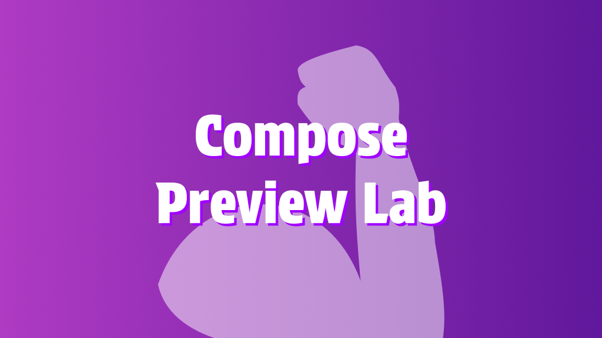

[FIXME WIP DOCUMENTATION]

# Compose Preview Lab



<p align="center">
<a href="./README.md">English</a>
 |
<a href="./README.ja.md">日本語</a>
 |
<a href="https://tbsten.github.io/compose-preview-lab/integrationTest/main/js/compose-preview-lab-gallery/">Sample</a>
|
<a href="https://tbsten.github.io/compose-preview-lab/integrationTest/main/js/">Documentation</a>
|
<a href="https://deepwiki.com/TBSten/compose-preview-lab">DeepWiki</a>
</p>

> [!IMPORTANT]
> このプロジェクトは現在開発中であり、APIは不安定で予告なく変更される可能性があります。
> 趣味のプロジェクトでの使用は問題ありませんが、本番プロジェクトでの使用はまだ推奨していません。

Compose Preview Labは、@Previewをインタラクティブなコンポーネントプレイグラウンドに変換します。
コンポーネントにパラメータを渡すことができ、静的なスナップショット以上の体験を提供します。手動テストが簡単になり、新しい開発者がコンポーネントをより早く理解できるようになります。
Compose Multiplatformに対応しています。

## Try online

- [Online Sample](https://tbsten.github.io/compose-preview-lab/integrationTest/main/js/compose-preview-lab-gallery/)

## セットアップ

<details>
<summary> [推奨] Compose Multiplatformプロジェクト</summary>

Compose Preview Labで`@Preview`を収集したいすべてのモジュールに対して、以下の設定を行ってください。

<a href="https://central.sonatype.com/artifact/me.tbsten.compose.preview.lab/core">

</a>
<a href="https://central.sonatype.com/artifact/com.google.devtools.ksp/symbol-processing-api">

</a>

```kts
plugins {
    // ⭐️ @Previewを収集するためにKSPを追加
    id("com.google.devtools.ksp") version "<ksp-version>"
    // ⭐️ Compose Preview Lab Gradleプラグインを追加
    id("me.tbsten.compose.preview.lab") version "<compose-preview-lab-version>"
}

kotlin {
    sourceSets {
        commonMain.dependencies {
            // ⭐️ Compose Preview Lab coreアーティファクトを追加
            implementation("me.tbsten.compose.preview.lab:core:<compose-preview-lab-version>")
        }
    }
}

dependencies {
    // ⭐️ Compose Preview Lab KSPプラグインを追加
    val composePreviewLabKspPlugin =
        "me.tbsten.compose.preview.lab:ksp-plugin:<compose-preview-lab-version>"
    add("kspCommonMainMetadata", composePreviewLabKspPlugin)
    // 各プラットフォーム
    add("kspAndroid", composePreviewLabKspPlugin)
    add("kspJvm", composePreviewLabKspPlugin)
    add("kspJs", composePreviewLabKspPlugin)
    add("kspWasmJs", composePreviewLabKspPlugin)
    // iOSターゲット（必要に応じて）
    // add("kspIosX64", composePreviewLabKspPlugin)
    // add("kspIosArm64", composePreviewLabKspPlugin)
    // add("kspIosSimulatorArm64", composePreviewLabKspPlugin)
}
```

</details>

<details>
<summary> Androidプロジェクト </summary>

> 🚨 警告
>
> 純粋なAndroidプロジェクト（Kotlin Multiplatformを使用していないプロジェクト）でもCompose Preview Labを使用できますが、
> Webでのブラウジングができないなど機能が大幅に制限されており、Compose Preview Labの利点を実感しにくい可能性があります。
> Android専用のプロジェクトであっても、Compose Multiplatformの使用を検討してください。
> この概念はCompose Preview Labに限らず、今後Composeを使用するすべてのプロジェクトで標準となるべきだと考えています。

<a href="https://central.sonatype.com/artifact/me.tbsten.compose.preview.lab/core">

</a>
<a href="https://central.sonatype.com/artifact/com.google.devtools.ksp/symbol-processing-api">

</a>

```kts
plugins {
    // ⭐️ @Previewを収集するためにKSPを追加
    id("com.google.devtools.ksp") version "<ksp-version>"
    // ⭐️ Compose Preview Lab Gradleプラグインを追加
    id("me.tbsten.compose.preview.lab") version "<compose-preview-lab-version>"
}

dependencies {
    implementation("me.tbsten.compose.preview.lab:core:<compose-preview-lab-version>")
    ksp("me.tbsten.compose.preview.lab:ksp-plugin:<compose-preview-lab-version>")
}
```

</details>

## プレビューのインタラクティブモードの強化

`PreviewLab` Composableと`***Field()`、`onEvent()`などの関数を使用して、Previewのインタラクティブモードを強化します。

`@Preview`
を収集し、[FigmaのComponent Playground](https://help.figma.com/hc/en-us/articles/15023124644247-Guide-to-Dev-Mode#try-component-variations-in-the-component-playground)
のようなインタラクティブなプレイグラウンドを作成できます。

```kt
@Preview
@Composable
private fun MyButtonPreview() = PreviewLab {
    MyButton(
        text = fieldValue { StringField("Click Me") },
        onClick = { onEvent("MyButton.onClick") },
    )
}
```


## 2つのコアコンセプト

| Field                                                                                                                                    | Event                                                                                          |
|------------------------------------------------------------------------------------------------------------------------------------------|------------------------------------------------------------------------------------------------|
| `fieldValue { ***Field(defaultValue) }` Previewで値を手動で変更できるようにします。<br> これにより、PreviewParameterProviderが大量のPreviewを表示して認知負荷が増加する問題とお別れできます。 | Previewでイベントが発生したとき（よくある例：Button#onClick、HomeScreen#onIntent）、`onEvent()`を呼び出してイベントの発生を可視化します。 |
| TODO image                                                                                                                               | TODO image                                                                                     |

## [Storytale](https://github.com/Kotlin/Storytale)との違い

Compose Preview Labと類似したソリューションとして、Jetbrainsによる[Storytale](https://github.com/Kotlin/Storytale)があります。
以下の表は両者の違いを示しています。

(以下の情報は2025年6月28日時点のものです)

|                       | Compose Preview Lab                                                                                                 | Storytale                                                                                                                                                                                                                                                    |
|-----------------------|---------------------------------------------------------------------------------------------------------------------|--------------------------------------------------------------------------------------------------------------------------------------------------------------------------------------------------------------------------------------------------------------|
| UIコンポーネントのカタログ化       | ✅                                                                                                                   | ✅                                                                                                                                                                                                                                                            |
| ソースコードの表示             | ❌ <br> 将来のサポートを検討中です。                                                                                               | ✅                                                                                                                                                                                                                                                            |
| Composableカタログの準備の容易さ | ✅ <br> @Previewを`PreviewLab { }`で囲むだけです。                                                                            | ⚠️ <br> `***Stories`ソースセットにコードを配置する必要があります。@Previewを使った既存のコードは移行する必要があります。                                                                                                                                                                                   |
| 独自型のパラメータ             | ✅ <br> カスタムFieldを実装することで、操作UIを含めてUIを自由にカスタマイズできます。([参照](https://example.com))。SelectableFieldなどの便利なユーティリティも提供しています。 | ❌ <br> サポートされていません。[ソースコード](https://github.com/Kotlin/Storytale/blob/57f41aaee1a21d98d637fe752931715232deed9e/modules/gallery/src/commonMain/kotlin/org/jetbrains/compose/storytale/gallery/material3/StoryParameters.kt#L161)を見ると、将来的にサポートされる可能性はゼロではありません。 |

## ロードマップ

- [x] FieldとEvent APIの最小限の準備
- [ ] ライブラリの安定化（v1.0.0のリリース）
- [x] Composeクラスを操作するField
- [ ] UIレビュー体験を向上させる機能
- [ ] ソースコードの表示
- [ ] Compose Preview Labによるビジュアルリグレッションテスト
- [ ] アノテーション機能

## 詳細情報

- [WIP] [ドキュメントサイト]()

### 各ユースケースの実践ガイド

- [WIP] [Compose Preview Labを使用してプルリクエストでのレビュー体験を向上させる](https://github.com/TBSten/compose-preview-lab/blob/main/docs/improve-review-experience-on-pull-request.md)
- [WIP] [コンポーネントライブラリのドキュメントを改善する](https://github.com/TBSten/compose-preview-lab/blob/main/docs/improve-documentation-of-component-library.md)

### Compose Preview Labをより深く理解する

- [WIP] [Compose Preview Labのヒント](https://github.com/TBSten/compose-preview-lab/blob/main/docs/tips.md)
- [WIP] [Fieldのカスタマイズと拡張](https://github.com/TBSten/compose-preview-lab/blob/main/docs/customize-field.md)
- [WIP] [設計ドキュメント](https://github.com/TBSten/compose-preview-lab/blob/main/docs/design/index.md)

### 開発に貢献する方へ

- [Online Sample](https://tbsten.github.io/compose-preview-lab/integrationTest/main/js/compose-preview-lab-gallery/)
- [WIP] [コントリビューションガイド](https://github.com/TBSten/compose-preview-lab/blob/main/docs/contribute-guide.md)
