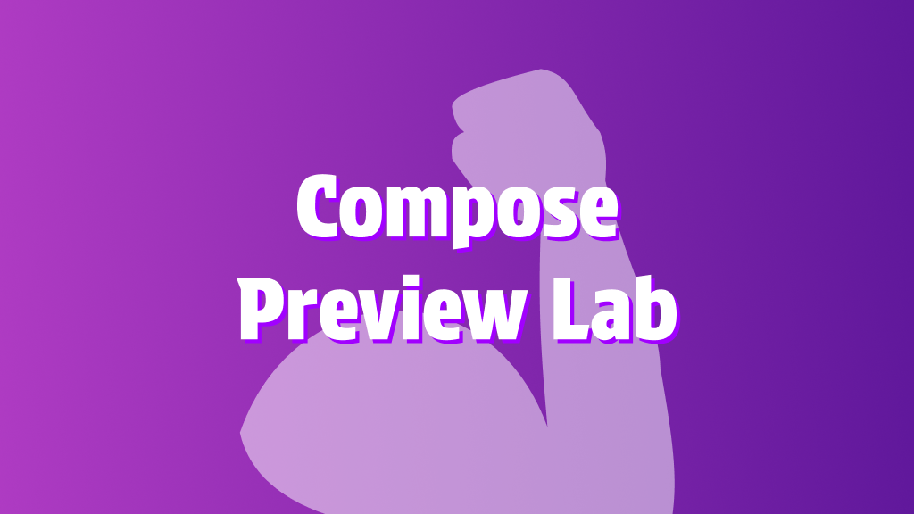
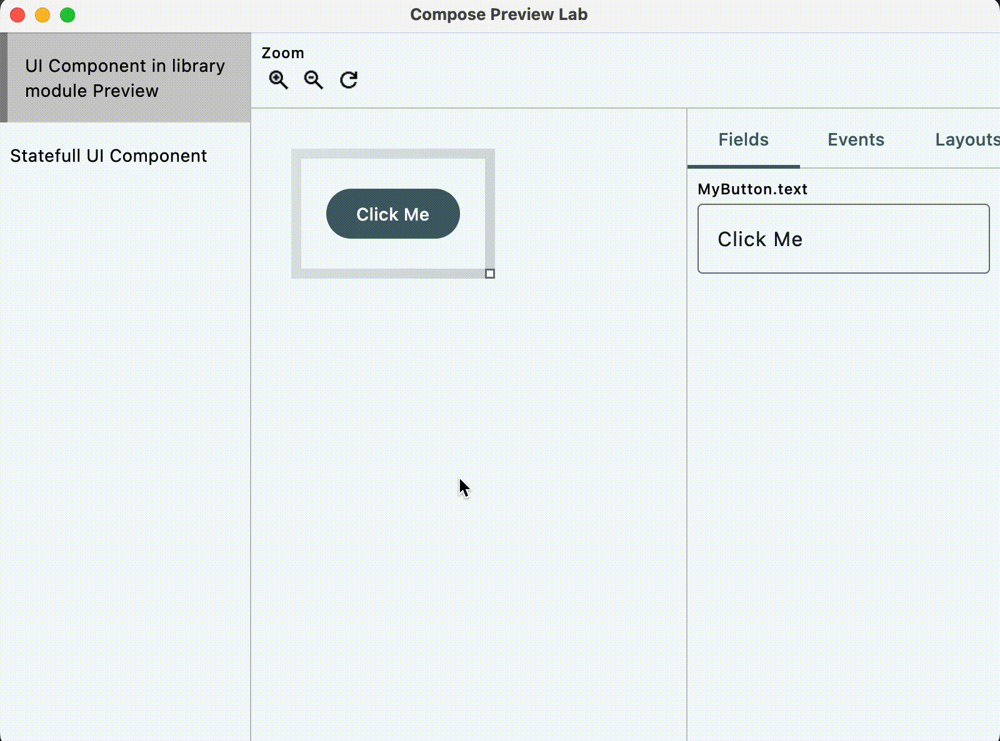

[FIXME WIP DOCUMENTATION]

# Compose Preview Lab



<p align="center">
<a href="https://github.com/TBSten/compose-preview-lab/blob/main/README.md">English</a>
 | 
<a href="https://github.com/TBSten/compose-preview-lab/blob/main/README.ja.md">日本語</a>
 | 
<a href="https://deepwiki.com/TBSten/compose-preview-lab">DeepWiki</a>
</p>

> [!IMPORTANT]
> This project is still a work in progress, and its API is unstable and may change without any
> notice. Using this plugin for a hobby project is fine, but we do not recommend using it for
> production projects yet.

## Setup

<details>
<summary> [Recommended] Compose Multiplatform Project</summary>

Please set up the following for all modules for which you want to collect `@Preview` using Compose
Preview Lab.

```kts
plugins {
    // ⭐️ Add KSP for collect `@Preview`
    id("com.google.devtools.ksp") version "<ksp-version>"
}

kotlin {
    sourceSets {
        commonMain.dependencies {
            // ⭐️ Add Compose Preview Lab runtime artifact
            implementation("me.tbsten.compose.preview.lab:runtime:<compose-preview-lab-version>")
        }
    }
}

dependencies {
    // ⭐️ Add Compose Preview Lab KSP plugin
    val composePreviewLabKspPlugin =
        "me.tbsten.compose.preview.lab:ksp-plugin:<compose-preview-lab-version>"
    add("kspCommonMainMetadata", composePreviewLabKspPlugin)
    // each platform
    add("kspAndroid", composePreviewLabKspPlugin)
    add("kspIosX64", composePreviewLabKspPlugin)
    add("kspIosArm64", composePreviewLabKspPlugin)
    add("kspJvm", composePreviewLabKspPlugin)
    add("kspJs", composePreviewLabKspPlugin)
    add("kspWasmJs", composePreviewLabKspPlugin)
}
```

</details>

<details>
<summary> Android Project </summary>

> 🚨 WARNING
> 
> Pure Android projects (projects that do not use the Kotlin Multiplatform) can also use
> the Compose Preview Lab, but their functionality is severely limited,
> such as not being able to browse on the
> web, and it may be difficult to see the benefits of the Compose Preview Lab. However, the
> Consider using Compose Multiplatform even if your project is Android-only.
> I believe that this concept is not limited to Compose Preview Lab, but should be the norm for all
> projects using Compose in the future.

```kts
plugins {
    // ⭐️ add ksp for collect `@Preview`
    id("com.google.devtools.ksp") version "<ksp-version>"
}

dependencies {
    ksp("me.tbsten.compose.preview.lab:ksp-plugin:<compose-preview-lab-version>")
}
```


</details>

## Accelerating preview interactive mode

Use `PreviewLab` Composable and functions such as `***Field()` `onEvent()` to enhance Preview's
Interactive mode.

You can collect `@Preview`and create an interactive Playground
like [Figma's Component Playground](https://help.figma.com/hc/en-us/articles/15023124644247-Guide-to-Dev-Mode#try-component-variations-in-the-component-playground).

```kt
@Preview
@Composable
private fun MyButtonPreview() = PreviewLab {
    MyButton(
        text = fieldValue { StringField("Click Me") },
        onClick = { onEvent("MyButton.onClick") },
    )
}
```



## Three core concepts

| Field | Event | [Experimental] Layout |
|---|---|---|
| `fieldValue { ***Field(defaultValue) }` Allows you to manually change values in the Preview. <br> This allows you to say goodbye to the problem of PreviewParameterProvider displaying a large number of Previews and increasing the cognitive load. | When an event occurs in Preview (common examples: Button#onClick, HomeScreen#onIntent), call `onEvent()` to visualize the occurrence of the event. | Visualize the position and size of the Component and the distance between Components with `Modifier.layoutLab()` set. |
| TODO image | TODO image | TODO image |

## Differences from [Storytale](https://github.com/Kotlin/Storytale)

A solution similar to Compose Preview Lab is [Storytale](https://github.com/Kotlin/Storytale) from
Jetbrains.
The table below shows the differences between the two.

(The following information is current as of 28.6.2025)

| | Compose Preview Lab | Storytale |
|---|---|---|
| Cataloging UI Component | ✅ | ✅ |
| View source code | ❌ <br> Future support is under consideration. | ✅ |
| Ease of preparing the Composable catalog | ✅ <br> Just enclose @Preview in `PreviewLab { }`. | ⚠️ <br> You must have the code in the `***Stories` source set. Existing code with @Preview must be migrated. |
| Parameter of your own type | ✅ <br> By implementing a custom Field, you can freely customize the UI, including the operation UI. ([see](https://example.com))。It also provides useful utilities such as SelectableField. | ❌ <br> Not supported. Following the [source code](https://github.com/Kotlin/Storytale/blob/57f41aaee1a21d98d637fe752931715232deed9e/modules/gallery/src/commonMain/kotlin/org/jetbrains/compose/storytale/gallery/material3/StoryParameters.kt#L161) shows that there is a non-zero chance of support in the future. |

## Roadmap

- [ ] Minimum preparation for Field and Event API
- [ ] Library stabilization (release of v1.0.0)
- [ ] Fields that manipulate Compose classes
- [ ] Features that improve the UI review experience
- [ ] Display Source code
- [ ] Visual Regression Test by Compose Preview Lab
- [ ] Annotation function

## More information

- [WIP] [Documentation Site]()
- [WIP] [Improve Review Experience on Pull Request by using Compose Preview Lab](https://github.com/TBSten/compose-preview-lab/blob/main/docs/improve-review-experience-on-pull-request.md)
- [WIP] [Tips for Compose Preview Lab](https://github.com/TBSten/compose-preview-lab/blob/main/docs/tips.md)
- [WIP] [Improve documentation of component library](https://github.com/TBSten/compose-preview-lab/blob/main/docs/improve-documentation-of-component-library.md)
