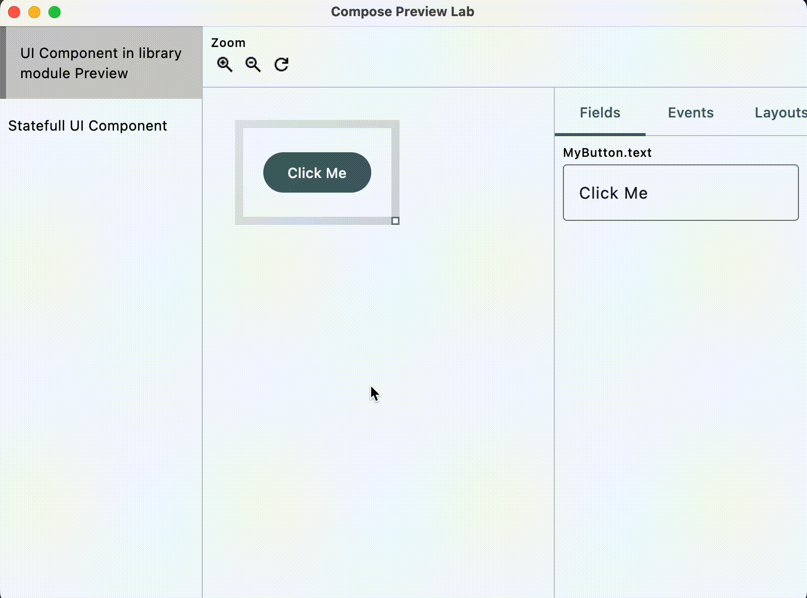

# Compose Preview Lab


> [!IMPORTANT]
> This project is still a work in progress, and its API is unstable and may change without any notice. Using this plugin for a hobby project is fine, but we do not recommend using it for production projects yet.

## Accelerating preview interactive mode

Use `PreviewLab` Composable and functions such as `***Field()` `onEvent()` to enhance Preview's
Interactive mode.

<table>
<tbody>

<tr>

<td>

```kt
@Preview
@Composable
private fun MyButtonPreview() = PreviewLab {
    MyButton(
        text = fieldValue { StringField("Click Me") },
        onClick = { onEvent("MyButton.onClick") },
    )
}
```

</td>

<td>



</td>

</tr>

<tr>


</tr>

</tbody>
</table>

## More information

- [WIP] [Official Documentation Site](https://example.com)
