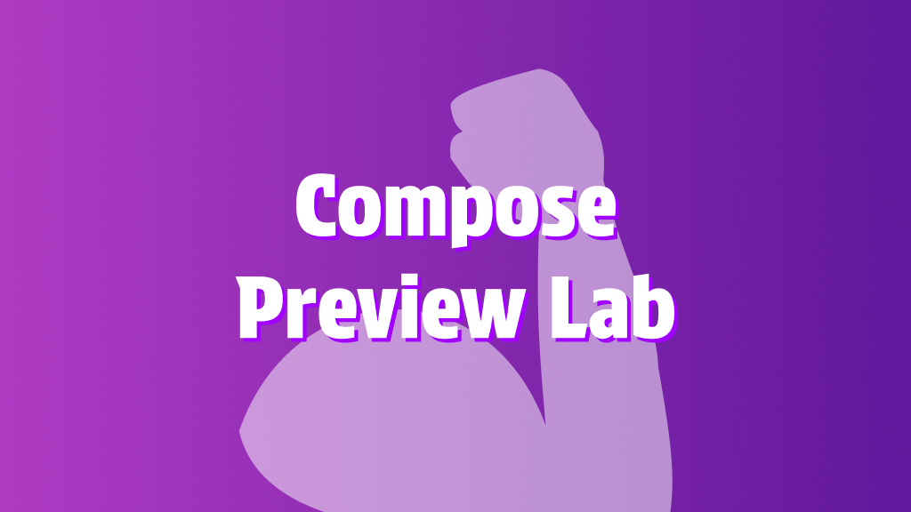
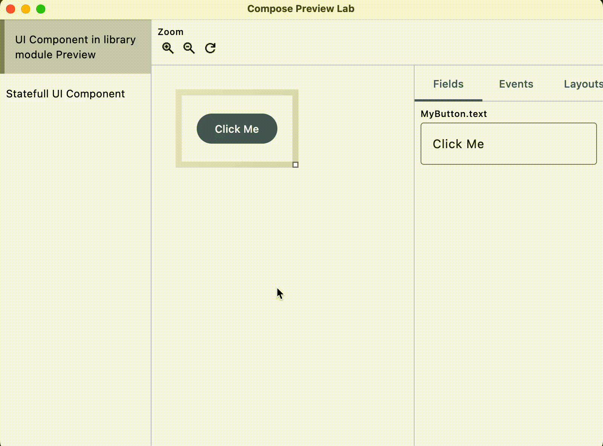

# Compose Preview Lab



<p align="center">
<a href="./README.md">English</a>
 |
<a href="./README.ja.md">日本語</a>
 |
<a href="https://tbsten.github.io/compose-preview-lab/integrationTest/main/js/compose-preview-lab-gallery/">Sample</a>
|
<a href="https://tbsten.github.io/compose-preview-lab/integrationTest/main/js/">Documentation</a>
|
<a href="https://deepwiki.com/TBSten/compose-preview-lab">DeepWiki</a>
</p>

> [!IMPORTANT]
> This project is still a work in progress, and its API is unstable and may change without any
> notice. Using this plugin for a hobby project is fine, but we do not recommend using it for
> production projects yet.

Compose Preview Lab turns @Preview into an interactive Component Playground.
You can pass parameters to components, enabling more than just static snapshots—making manual testing easier and helping new
developers understand components faster.
Compose Multiplatform is supported.

## Try online

- [Online Sample](https://tbsten.github.io/compose-preview-lab/integrationTest/main/js/compose-preview-lab-gallery/)

## Setup

<a href="https://central.sonatype.com/artifact/me.tbsten.compose.preview.lab/core">

</a>

> [!NOTE]
> Compose Preview Lab uses a Kotlin Compiler Plugin to collect `@Preview` functions. KSP is **no longer required**.

<details>
<summary> [Recommended] Compose Multiplatform Project - Simple Setup with Starter</summary>

The easiest way to get started. The `starter` module bundles all core modules (core, field, ui, preview-lab, gallery) into a
single dependency.

> ⚠️ The `me.tbsten.compose.preview.lab` plugin must be applied **before** the Compose Compiler plugin.

```kts
plugins {
    // ⭐️ Add Compose Preview Lab Gradle plugin (apply BEFORE composeCompiler)
    id("me.tbsten.compose.preview.lab") version "<compose-preview-lab-version>"
    id("org.jetbrains.kotlin.plugin.compose")
}

kotlin {
    sourceSets {
        commonMain.dependencies {
            // ⭐️ Add Compose Preview Lab starter (includes all core modules)
            implementation("me.tbsten.compose.preview.lab:starter:<compose-preview-lab-version>")
        }
    }
}
```

Then declare a collection point in `commonMain`. The Compiler Plugin will inject every `@Preview` it finds into this property.

```kt
// src/commonMain/kotlin/Previews.kt
package app

import me.tbsten.compose.preview.lab.collectModulePreviews

val appPreviews by collectModulePreviews()
```

</details>

<details>
<summary> Compose Multiplatform Project - Individual Modules</summary>

If you need fine-grained control over dependencies, you can add individual modules instead of the starter.

```kts
plugins {
    // ⭐️ Add Compose Preview Lab Gradle plugin (apply BEFORE composeCompiler)
    id("me.tbsten.compose.preview.lab") version "<compose-preview-lab-version>"
    id("org.jetbrains.kotlin.plugin.compose")
}

kotlin {
    sourceSets {
        commonMain.dependencies {
            // ⭐️ Add individual modules as needed
            implementation("me.tbsten.compose.preview.lab:core:<compose-preview-lab-version>")
            implementation("me.tbsten.compose.preview.lab:field:<compose-preview-lab-version>")
            implementation("me.tbsten.compose.preview.lab:ui:<compose-preview-lab-version>")
            implementation("me.tbsten.compose.preview.lab:preview-lab:<compose-preview-lab-version>")
            implementation("me.tbsten.compose.preview.lab:gallery:<compose-preview-lab-version>")
        }
    }
}
```

**Available modules:**
| Module | Description |
|--------|-------------|
| `core` | Core types and interfaces (CollectedPreview, PreviewLabPreview, etc.) |
| `field` | Field API for interactive parameter editing (StringField, IntField, etc.) |
| `ui` | Common UI components used by PreviewLab |
| `preview-lab` | PreviewLab Composable with Field and Event integration |
| `gallery` | PreviewLabGallery for displaying preview lists |

</details>

<details>
<summary> Android Project </summary>

> 🚨 WARNING
>
> Pure Android projects (projects that do not use the Kotlin Multiplatform) can also use
> the Compose Preview Lab, but their functionality is severely limited,
> such as not being able to browse on the
> web, and it may be difficult to see the benefits of the Compose Preview Lab. However, the
> Consider using Compose Multiplatform even if your project is Android-only.
> I believe that this concept is not limited to Compose Preview Lab, but should be the norm for all
> projects using Compose in the future.

```kts
plugins {
    // ⭐️ Add Compose Preview Lab Gradle plugin (apply BEFORE composeCompiler)
    id("me.tbsten.compose.preview.lab") version "<compose-preview-lab-version>"
    id("org.jetbrains.kotlin.plugin.compose")
}

dependencies {
    // ⭐️ Use starter for simple setup (or individual modules if needed)
    implementation("me.tbsten.compose.preview.lab:starter:<compose-preview-lab-version>")
}
```

</details>

## Accelerating preview interactive mode

Use `PreviewLab` Composable and functions such as `***Field()` `onEvent()` to enhance Preview's
Interactive mode.

You can collect `@Preview`
and create an interactive Playground
like [Figma's Component Playground](https://help.figma.com/hc/en-us/articles/15023124644247-Guide-to-Dev-Mode#try-component-variations-in-the-component-playground).

```kt
@Preview
@Composable
private fun MyButtonPreview() = PreviewLab {
    MyButton(
        text = fieldValue { StringField("Click Me") },
        onClick = { onEvent("MyButton.onClick") },
    )
}
```



## Two core concepts

| Field                                                                                                                                                                                                                                                | Event                                                                                                                                              |
|------------------------------------------------------------------------------------------------------------------------------------------------------------------------------------------------------------------------------------------------------|----------------------------------------------------------------------------------------------------------------------------------------------------|
| `fieldValue { ***Field(defaultValue) }` Allows you to manually change values in the Preview. <br> This allows you to say goodbye to the problem of PreviewParameterProvider displaying a large number of Previews and increasing the cognitive load. | When an event occurs in Preview (common examples: Button#onClick, HomeScreen#onIntent), call `onEvent()` to visualize the occurrence of the event. |
| TODO image                                                                                                                                                                                                                                           | TODO image                                                                                                                                         |

## Differences from [Storytale](https://github.com/Kotlin/Storytale)

A solution similar to Compose Preview Lab is [Storytale](https://github.com/Kotlin/Storytale) from
Jetbrains.
The table below shows the differences between the two.

(The following information is current as of 28.6.2025)

|                                          | Compose Preview Lab                                                                                                                                                                          | Storytale                                                                                                                                                                                                                                                                                                            |
|------------------------------------------|----------------------------------------------------------------------------------------------------------------------------------------------------------------------------------------------|----------------------------------------------------------------------------------------------------------------------------------------------------------------------------------------------------------------------------------------------------------------------------------------------------------------------|
| Cataloging UI Component                  | ✅                                                                                                                                                                                            | ✅                                                                                                                                                                                                                                                                                                                    |
| View source code                         | ❌ <br> Future support is under consideration.                                                                                                                                                | ✅                                                                                                                                                                                                                                                                                                                    |
| Ease of preparing the Composable catalog | ✅ <br> Just enclose @Preview in `PreviewLab { }`.                                                                                                                                            | ⚠️ <br> You must have the code in the `***Stories` source set. Existing code with @Preview must be migrated.                                                                                                                                                                                                         |
| Parameter of your own type               | ✅ <br> By implementing a custom Field, you can freely customize the UI, including the operation UI. ([see](https://example.com)). It also provides useful utilities such as SelectableField. | ❌ <br> Not supported. Following the [source code](https://github.com/Kotlin/Storytale/blob/57f41aaee1a21d98d637fe752931715232deed9e/modules/gallery/src/commonMain/kotlin/org/jetbrains/compose/storytale/gallery/material3/StoryParameters.kt#L161) shows that there is a non-zero chance of support in the future. |

## Roadmap

- [x] Minimum preparation for Field and Event API
- [ ] Library stabilization (release of v1.0.0)
- [x] Fields that manipulate Compose classes
- [ ] Features that improve the UI review experience
- [ ] Display Source code
- [ ] Visual Regression Test by Compose Preview Lab
- [ ] Annotation function

## More information

- [Documentation](https://tbsten.github.io/compose-preview-lab/integrationTest/main/js/)
- [Getting Started](https://tbsten.github.io/compose-preview-lab/integrationTest/main/js/docs/get-started)
- [Installation](https://tbsten.github.io/compose-preview-lab/integrationTest/main/js/docs/category/installation)
- [Guides](https://tbsten.github.io/compose-preview-lab/integrationTest/main/js/docs/guides)
- [Tutorials](https://tbsten.github.io/compose-preview-lab/integrationTest/main/js/docs/tutorials)
- [DeepWiki](https://deepwiki.com/TBSten/compose-preview-lab)

### For Contributors

- [Online Sample](https://tbsten.github.io/compose-preview-lab/integrationTest/main/js/compose-preview-lab-gallery/)
- [Repository](https://github.com/TBSten/compose-preview-lab)
